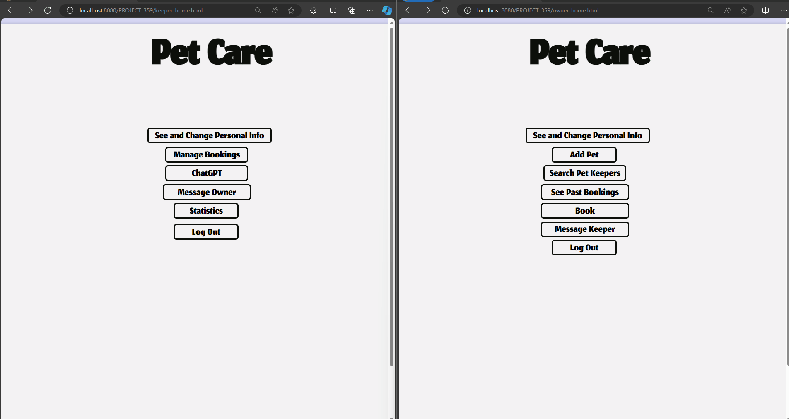

# PetCare-Pet-Keeping

Welcome to **PetCare-Pet-Keeping**, a comprehensive management system designed for Pet Owners and Pet Keepers. This project is part of the CS359-Web Programming course. For a detailed overview, please refer to the "project_details.pdf" file provided (in Greek).

## Important Information
The database and some fundamental functions were initially set up by the course instructor. I have expanded upon this foundation by developing additional functions that enhance interaction with the database.

## Requirements
To ensure the proper functioning of the PetCare-Pet-Keeping system, please adhere to the following requirements:
1. **Xampp**: Must be installed on your system.
2. **TomCat**: Should be installed and properly configured.
3. **Project Import**: Import the project into your IDE and resolve any issues related to the Jettison Library location.
4. **Database Creation**: If a database does not exist, create one using the DataBase Creator. This can be done through the interaction between xampp, TomCat, and the website interface.

## Notes
- **Bonus Features**: No bonus features were implemented in this version.
- **ChatGPT Integration**: Currently not operational due to an "Exceeded Limit Quota" error.
- **Admin Functions**: The ability to delete users as an admin is not functional.
- **Account Modifications**: Changing account details is not possible for both PetKeepers and PetOwners at this time.
- **Java Compatibility**: For older versions of Java, it is necessary to import `jakarta.servlet.http.HttpServlet` instead of `javax.servlet.http.HttpServlet` etc.

---

## Usage Examples:

